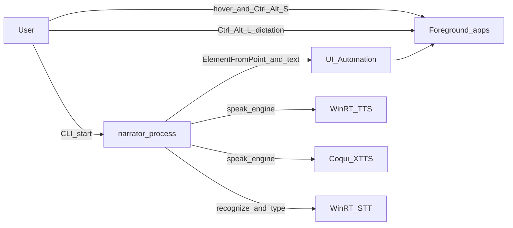
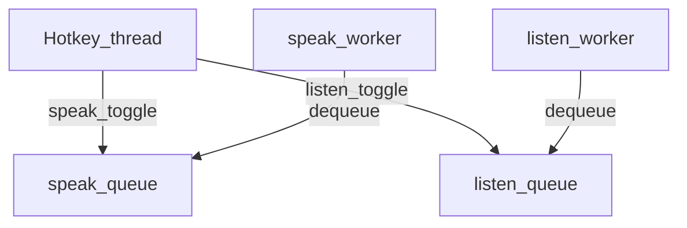

# Narrator — architecture

This document turns [`IDEA.md`](IDEA.md) into **implementation-facing** decisions: process shape, recommended **OS and third-party software**, and module boundaries. Observable behavior is in [`SPEC.md`](SPEC.md).

**Default hotkeys (configurable everywhere):** **Ctrl+Alt+S** = speak (TTS from hover), **Ctrl+Alt+L** = listen (STT into focused field). See [`narrator/settings.py`](narrator/settings.py) and [`narrator/settings_schema.md`](narrator/settings_schema.md).

---

## 1. Purpose and scope

| In scope | Out of scope (v1) |
|----------|-------------------|
| Windows desktop narrator: CLI process, global hotkeys, pointer-based UI Automation for **speak**, **WinRT** and optional **Coqui XTTS** TTS + WinRT STT, local speech | macOS/Linux, cloud TTS, GUI settings app, per-app plugins |
| One repo, minimal dependencies, clear threading model | Universal OCR, reading DRM-protected or canvas-only UIs |

**Relationship to other docs**

- [`IDEA.md`](IDEA.md) — *what* we build and *why*.
- **This file** — *how* we structure the system and *which* stacks we use.
- [`SPEC.md`](SPEC.md) — exact toggle semantics, capture rules, and error strings.
- [`docs/TTS_PLAYBACK_ROADMAP.md`](docs/TTS_PLAYBACK_ROADMAP.md) — *end-to-end* speak path: preprocess, chunking, per-engine synthesis, prefetch, playback quality and knobs.

---

## 2. Context

The narrator **does not** embed into target apps. It is a **separate process** that uses accessibility and audio facilities like other assistive or automation tools.

---

## 3. Runtime and deployment

| Choice | Recommendation |
|--------|----------------|
| **OS** | **Windows 10/11** (64-bit). UI Automation and speech APIs are assumed present. |
| **Language** | **Python 3.11+** — good balance of typing, stdlib, and maintained wheels for Windows bindings. |
| **Distribution** | Single **virtualenv** + editable install; **`setup.bat`** installs **`[speak-xtts]`** (PyTorch + Coqui + prefetch). See **[`docs/SETUP.md`](docs/SETUP.md)**. Optional: PyInstaller **exe**. |
| **Console** | **Default: keep a console** for stderr logging during MVP. Optional flag or **`pythonw.exe`** for tray / no window. |

**Why not C# only?** A .NET host would be very Windows-native, but the product goal is **minimal code** and **Python-first**; we accept PyWinRT bindings instead of rewriting in WPF.

---

## 4. Recommended third-party stack

### 4.1 Global hotkeys (default **Ctrl+Alt+S** + **Ctrl+Alt+L**)

| Option | Verdict |
|--------|---------|
| **Low-level hook (`WH_KEYBOARD_LL`)** | **Chosen on Windows** (`narrator.win32_hotkey_hook`). The hook returns **non-zero** for matching speak/listen chords so those **keystrokes are not delivered** to the rest of the chain (foreground apps lose the shortcut while Narrator runs). Repeat key events for a held chord are swallowed without re-triggering toggle. |
| **`pynput` `GlobalHotKeys`** | Used on **non-Windows** only; it does **not** suppress keys to other apps. |

**Limits (Windows):** User-mode hooks **cannot** override the **secure attention sequence** (e.g. **Ctrl+Alt+Del**), some **exclusive full-screen** input paths, or every **elevation / integrity** boundary. Those are OS policies, not something third-party code can disable.

### 4.2 Pointer position (speak path)

| Option | Verdict |
|--------|---------|
| **`ctypes`** + `user32.GetCursorPos` | **Chosen.** No extra package; cursor position at **speak** hotkey time. |

### 4.3 UI Automation (hit-test + text)

| Option | Verdict |
|--------|---------|
| **`uiautomation`** | **Chosen** for **ElementFromPoint**, tree walks, **TextPattern** / **Value**. |

### 4.4 Speech — TTS (offline)

| Option | Verdict |
|--------|---------|
| **WinRT** `Windows.Media.SpeechSynthesis` (PyWinRT) | **Fallback** when `speak_engine` is `winrt`, or when `auto` resolves here (no Coqui / no Piper model). Reliable **voice** selection via `SpeechSynthesizer.voice`. |
| **Piper** (`piper-tts`, optional extra **`speak-piper`**) | Used when `speak_engine` is `piper`, or when `auto` picks Piper (Coqui unavailable but ONNX on disk). Fast, small ONNX; **`SynthesisConfig.length_scale`** applies `speaking_rate` at synthesis time (no whole-file librosa in `wav_speaking_rate`). See `narrator/tts_piper.py`, **`scripts/prefetch_piper_voice.py`** (default id **`en_US-ryan-high`**). |
| **Coqui XTTS** (`coqui-tts`, optional extra **`speak-xtts`**) | **Preferred** for `auto` when Coqui loads, or when `speak_engine` is `xtts`. High-quality neural speech; **large** model download; see `narrator/tts_xtts.py`, **`scripts/prefetch_xtts_model.py`**. |

**Settings:** `speak_engine`: `auto` \| `winrt` \| `xtts` \| `piper` (see [`narrator/settings.py`](narrator/settings.py)). **`auto`** prefers XTTS if Coqui loads, else Piper if an ONNX file exists, else WinRT.

**Playback:** Synthesize to a **temp WAV**, play via **`narrator/wav_play_win32`** (winmm `waveOut`, interruptible). Second **speak** chord cancels WinRT synth path; Piper/XTTS use blocking synthesis with cancel-before-playback behavior.

**Live speaking rate (Ctrl+Alt+Plus/Minus during playback):** The worker updates `settings.speaking_rate`. **By default** `live_rate_defer_during_playback` is **false**: the player **stops the current buffer**, adjusts the **tail** tempo via **`live_rate_in_play_engine`** (default **WSOLA**, pitch-preserving), and reopens `waveOut`—guarded by [`playback_gate`](narrator/playback_control.py). Optional engines: **librosa phase vocoder**, **resample** (tape-speed). **`live_rate_defer_during_playback = true`** (or `NARRATOR_LIVE_RATE_DEFER=1`): hotkeys apply to the **next** utterance only. **Chunk-boundary resume** is the default cut strategy (`live_rate_safe_chunk_discard`); optional sample-accurate seek via `NARRATOR_LIVE_RATE_ACCURATE_SEEK=1`. Tunables and `NARRATOR_DEBUG_LIVE_RATE` / `NARRATOR_DEBUG_AUDIO` are documented in README. **Future:** optional **WASAPI** path; not implemented today.

### 4.5 Speech — STT (listen path)

| Option | Verdict |
|--------|---------|
| **WinRT** `Windows.Media.SpeechRecognition` | **Chosen** for continuous dictation in `narrator.listen`. |

### 4.6 Summary dependency list

| Package | Role |
|---------|------|
| `pynput` | STT typing helpers; non-Windows hotkeys only (`GlobalHotKeys`) |
| `uiautomation` | `ElementFromPoint`, tree walk, text patterns |
| `winrt-*` (PyWinRT) | `SpeechSynthesizer`, speech recognition |
| `coqui-tts` (optional **`[speak-xtts]`**) | Neural XTTS synthesis when `speak_engine` is `xtts` or `auto` (when Coqui loads) |
| `piper-tts` (optional **`[speak-piper]`**) | Neural Piper ONNX synthesis when `speak_engine` is `piper` or `auto` (Coqui missing, model on disk) |
| `pyperclip` | Clipboard fallback for listen insertion (see `narrator.listen.insert_text`) |
| *(stdlib)* `ctypes` | `GetCursorPos` |

Pin versions in `requirements.txt` / `requirements-lock.txt`.

---

## 5. Process and threading model

**Single OS process**, **three logical roles**:

1. **Hotkey thread** (`pynput`): on **speak** chord → enqueue **`speak_toggle`** to **speak queue**; on **listen** chord → **`listen_toggle`** to **listen queue**. **Never** call UIA or WinRT here.
2. **Speak worker thread:** dequeue from speak queue → **capture → TTS → interruptible playback**.
3. **Listen worker thread:** dequeue from listen queue → **start/stop** WinRT dictation session (see `narrator.listen.session`).

**Speaking state (speak worker only):** Tracks **idle** / **synthesizing** / **playing**; second **speak** chord cancels synthesis/playback. This state **does not** apply to the listen worker.

**Independence (product rule):** Speak and listen **never** coordinate for cancellation. Separate queues and threads mean **dictation can run while TTS plays**, and **TTS can run while dictation is active** — no mutual exclusion, no automatic stop of one when the other starts. Avoid shared locks or “global audio mode” that would couple them. Shutdown is the only cross-cutting event (`shutdown` on both queues).

**Why queues:** Decouples hook latency from slow UIA/TTS/STT.

---

## 6. Hotkey subsystem (architecture only)

- **Registration:** One `GlobalHotKeys` instance with two chords (defaults **Ctrl+Alt+S**, **Ctrl+Alt+L**); must resolve to **different** pynput chords.
- **Protocol:** [`narrator/protocol.py`](narrator/protocol.py) — `speak_toggle`, `listen_toggle`, `shutdown`.
- **Conflict handling:** Documented in README/SPEC; user remaps via CLI or TOML.

---

## 7. Pointer and hit-testing pipeline (speak)

Fixed pipeline on **speak_toggle** while idle:

1. **`GetCursorPos`** → screen `(x, y)` (physical pixels; **DPI** awareness in `narrator/dpi.py`).
2. **`ElementFromPoint`** at that location.
3. **Container normalization** (see §8): walk **ancestors** — exact depth/rules in **SPEC**.

**Not used for speak targeting:** caret offset as primary source (per IDEA).

---

## 8. Text extraction strategy (ordering)

**Goal:** One **ordered** Unicode string for **top-to-bottom** speech.

1. **`TextPattern` / `TextPattern2`** on the normalized element (or descendants).
2. **`ValuePattern.Current.Value`** for plain text controls.
3. **Name** / **HelpText** as last resort.
4. **Recursive tree walk** in UIA order if needed.

**Explicitly not primary:** `Ctrl+C` / clipboard for speak.

---

## 9. Speech subsystem (TTS)

- **Engines:** `speak_engine` in [`narrator/settings.py`](narrator/settings.py) — **`auto`** (XTTS if Coqui loads, else Piper if ONNX present, else WinRT), **`winrt`**, **`xtts`**, **`piper`**.
- **WinRT voices:** `--list-voices` (registry + WinRT `AllVoices`); CLI/TOML override via `voice` / display names.
- **Piper:** `narrator/tts_piper.py`; **`--list-piper-voices`**; prefetch via **`scripts/prefetch_piper_voice.py`** (used by **`setup.bat`**).
- **XTTS:** `narrator/tts_xtts.py` — `get_tts`, `synthesize_xtts_to_path`; **`--list-xtts-speakers`**; prefetch via **`scripts/prefetch_xtts_model.py`** (used by **`setup.bat`**).
- **Synthesis + stop:** `narrator/speech.py` — dispatches WinRT (asyncio + cancellable) vs Piper/XTTS (thread + blocking); playback via **`narrator/wav_play_win32`**.

**Pipeline detail (preprocess → chunk → prefetch → fades):** [`docs/TTS_PLAYBACK_ROADMAP.md`](docs/TTS_PLAYBACK_ROADMAP.md).

---

## 10. Listen subsystem (STT)

- **`narrator.listen.session`:** toggle dictation loop; WinRT in `narrator.listen.stt_winrt`.
- **`narrator.listen.insert_text`:** UIA set value / clipboard paste fallback.

---

## 11. Module layout

| Module | Responsibility |
|--------|----------------|
| `narrator/__main__.py` | CLI, start hotkey + speak + listen workers, shutdown |
| `narrator/hotkey.py` | `pynput` registration, two queues |
| `narrator/protocol.py` | Queue message names |
| `narrator/worker.py` | Speak worker loop |
| `narrator/listen/session.py` | Listen worker loop |
| `narrator/capture.py` | Cursor, `ElementFromPoint`, text extraction |
| `narrator/speech.py` | TTS dispatch (WinRT vs XTTS), playback, stop |
| `narrator/tts_xtts.py` | Coqui XTTS load/cache, synthesis, optional volume on WAV |
| `narrator/voices.py` | Registry + WinRT voice listing for `--list-voices` |
| `narrator/tray_mode.py` | Optional tray + Quit |

---

## 12. Failure modes and observability

| Failure | Architectural response |
|---------|-------------------------|
| No element / empty text (speak) | Log; optional beep |
| UIA denied / elevation mismatch | Log; see README elevation |
| TTS / STT error | Log; worker returns to idle |

**Logging:** **`logging`** to stderr, default INFO.

---

## 13. Security and compatibility

- **UI Automation** elevation mismatch (see README).
- **Low-level keyboard hooks** (`pynput`) — AV note in README; optional future **`RegisterHotKey`**.
- **DPI:** per-monitor awareness for hit-testing.

---

## 14. Extension points (future)

- **Tray** — shipped (`--tray`).
- **Per-app** normalization profiles (only if needed).

---

## 15. Traceability (IDEA → architecture)

| IDEA requirement | Where addressed |
|------------------|-----------------|
| CLI + background process | §3, §5 |
| **Ctrl+Alt+S** speak / **Ctrl+Alt+L** listen | §4.1, §5, §6 |
| Pointer-based speak, not caret | §7, §8 |
| Top-to-bottom reading | §8 |
| Offline / built-in voices (TTS) | §4.4, §9 |
| Dictation (STT) | §4.5, §10 |
| Speak/listen independence | §5 |

---

## 16. What we use this file for

| Audience | Use |
|----------|-----|
| **Implementers** | Module boundaries, thread rules, dependencies. |
| **Spec author** | Behavioral edge cases go in [`SPEC.md`](SPEC.md). |
| **Debugging** | “Wrong text” → §7–8; “no audio” → §9; “hotkey dead” → §6/§13. |

Optional future improvements (e.g. `RegisterHotKey`, file logging) are not scheduled here; see [`README.md`](README.md) and [`CHANGELOG.md`](CHANGELOG.md).
